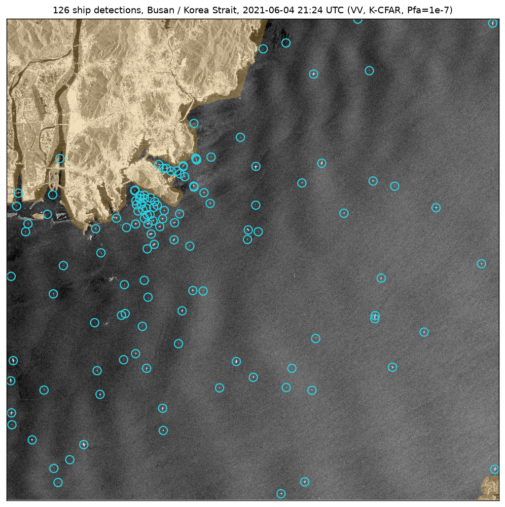
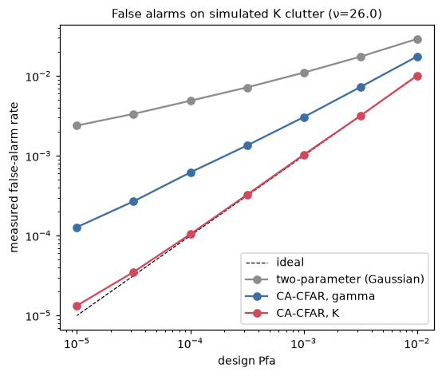
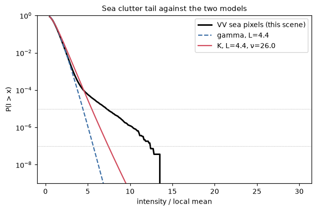
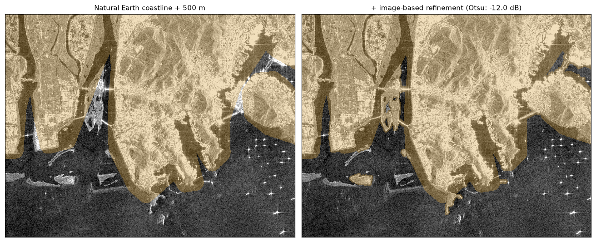
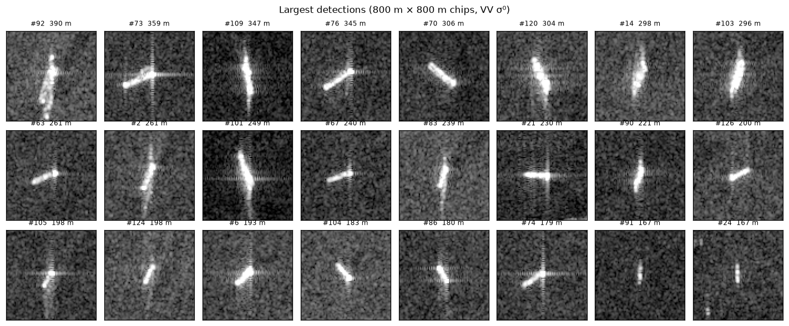

# sarship: ship detection in Sentinel-1 SAR imagery

From raw Sentinel-1 GRD data to geolocated ship detections, using only public
data read directly from the [Sentinel-1 bucket on AWS](https://registry.opendata.aws/sentinel-1/).
Demonstrated on Busan and the Korea Strait.

> **한국어 요약.** 공개 Sentinel-1 SAR 원시 영상(GRD)으로 선박을 탐지하는 Python
> 패키지입니다. 방사 보정(σ⁰)과 열잡음 처리, 해안선 데이터와 영상 기반 육지 마스킹,
> K분포 클러터 모델 기반 CFAR 탐지, 군집화를 거쳐 선박 위치를 GeoJSON으로 출력합니다.
> 2021년 6월 5일 06:24 KST 부산 영상에서 126척을 탐지했고, 그중 98척이 VH 편파에서도
> 확인됐습니다. 합성 클러터 검증에서는 K-CFAR만 설계 오경보율을 지켰습니다.



## Pipeline

```
raw GRD (DN) ─► calibration σ⁰ ─► land mask ─► CFAR ─► clustering ─► GeoJSON
                (+ noise LUT)     Natural Earth  K-dist.   size / shape /
                                  + image-based  clutter   open-sea filters
```

| Stage | What it does | Code |
|---|---|---|
| Data access | Parses the annotation XML (calibration, thermal noise, geolocation grid). Reads only the image tiles covering the area of interest, over HTTP range requests | `s1.py`, `annotation.py` |
| Calibration | σ⁰ = (DN² − N) / A², with the LUTs interpolated onto the image grid. Geolocation uses a bicubic spline over the tie-point grid, with a numerical inverse (round trip < 0.2 px) | `annotation.py` |
| Land mask | Natural Earth coastline mapped into image geometry, plus a 500 m buffer. Extended over piers, reclaimed land and bridges found in the image with an Otsu threshold and a connectivity rule | `landmask.py` |
| CFAR | Cell-averaging CFAR under a gamma, K or Gaussian clutter model, computed in O(N) with integral images. The K texture shape ν is estimated with log-cumulants | `cfar.py` |
| Clustering | Connected components, measured by second moments on the pixels within 15 dB of the peak. Size, peak and open-sea filters remove residual clutter | `detect.py` |

## Results

**Why the clutter model matters.** On simulated K clutter with the ν fitted to
this scene, only the K-CFAR holds its design false-alarm rate. At
Pfa = 10⁻⁴ the Gaussian two-parameter CFAR, the classic choice in SAR tools,
exceeds it 49×, and a gamma model 6×.

<p>


</p>

The real sea tail (right) is heavier than gamma, and the K model follows it
down to ~10⁻⁴. Beyond that, point targets too small to cluster make it heavier
than either model. The cluster size, peak brightness and open-sea tests
handle what the threshold cannot.

**Coastline databases miss ports.** Natural Earth has none of Busan's
reclaimed land, piers or breakwaters. Refining the mask from the image itself
removed most harbour false alarms:



**Detections.** The Busan window (57 × 58 km) holds 126 detections, mostly
in the outer anchorage south of Yeongdo and along the strait. 98 of them are
also found independently in VH.



## Usage

```bash
pip install -e ".[dev]"
pytest                 # unit tests (synthetic data, offline)
pytest -m network      # integration tests against the public bucket

# find scenes covering a point
sarship search --lon 129.05 --lat 35.08 --start 2021-06-04 --end 2021-06-04

# detect ships in a bounding box
sarship detect GRD/2021/6/4/IW/DV/S1B_IW_GRDH_1SDV_20210604T212406_20210604T212439_027212_034029_2B33 \
    --bbox 129.0 34.95 129.15 35.1 --out busan.geojson --figure busan.png
```

```python
from sarship import S1Product, ShipDetector, DetectorConfig

product = S1Product.from_aws("GRD/2021/6/4/IW/DV/S1B_IW_GRDH_...")
result = ShipDetector(DetectorConfig(method="k", pfa=1e-7)).run(
    product, bbox=(128.9, 34.75, 129.45, 35.2))
result.save_geojson("ships.geojson")
```

The full analysis, with every figure above, is in
[`notebooks/busan_ship_detection.ipynb`](notebooks/busan_ship_detection.ipynb).
The notebook is generated from `scripts/build_notebook.py` so that it diffs
cleanly. Detections are in [`docs/busan_detections.geojson`](docs/busan_detections.geojson).

## Design notes

- **CFAR runs on σ⁰ without noise subtraction.** Thermal noise is additive and
  nearly constant over a CFAR window, so it is simply part of the clutter.
  Subtracting it and clipping the negatives would distort the speckle
  statistics the threshold depends on.
- **Exact finite-sample threshold for gamma clutter.** With the mean estimated
  from N cells, X / mean̂ follows F(2L, 2NL), so the threshold stays correct near
  masks and image edges, where the ring holds fewer samples.
- **Log-cumulant ν estimation.** The second-moment estimator collapses when
  a few ship pixels are present (ν ≈ 0.008 on this scene). Var[ln I] =
  ψ₁(L) + ψ₁(ν) is robust (ν ≈ 21).

## Limitations

- There is no AIS ground truth. VV/VH agreement is a consistency check, not
  a detection rate.
- Azimuth ambiguities and the azimuth offset of moving ships are not modelled.
- Widths of small targets are still inflated by the ~20 m resolution.

## Project layout

```
src/sarship/   annotation.py  s1.py  landmask.py  cfar.py  detect.py
               synthetic.py   search.py  viz.py  cli.py
tests/         unit tests on synthetic data + network integration tests
notebooks/     executed analysis notebook (Busan, 2021-06-04)
scripts/       notebook builder
docs/          figures and detection GeoJSON
```

---

## 세계 상황판 (dashboard/)

OSINT 기반 지정학 상황판입니다. 게시본: https://claude.ai/artifact/VdTv11W2Zv8j55Rpf4aBGJ · 소스와 운영 방식은 [`dashboard/README.md`](dashboard/README.md), 수집 파이프라인은 [`dashboard/pipeline/README.md`](dashboard/pipeline/README.md).

[](https://github.com/Yang-wb908/Claude_cloud/actions/workflows/collect.yml)
[](https://github.com/Yang-wb908/Claude_cloud/actions/workflows/validate.yml)

이 저장소가 상황판 운영 체계입니다.

| GitHub 기능 | 역할 |
|---|---|
| Actions `collect.yml` (6시간 주기) | 58개 수집원에서 수집 → Claude 보강 → 스냅숏 병합 → 트립와이어 → SITREP → `index.html` 빌드 → 커밋 → Pages 배포 |
| Pages | 상황판을 자체 주소로 호스팅. 여기서는 외부 데이터(위키백과 Current events)를 실시간으로 읽습니다 |
| Issues `tripwire` | 임계치 돌파(호르무즈 통항 10척 미만, 브렌트 110달러, PLA 40대 등)를 Issue로 자동 생성·재확인 |
| Issues `rfi` / `source-proposal` | 템플릿으로 정보 요청·수집원 제안. 열린 RFI는 상황판 브리프에 '열린 정보 요청'으로 표시 |
| Releases `sitrep-<date>` | 매일 09:40 KST SITREP 마크다운과 데이터 스냅숏 zip을 보존 |
| 커밋 이력 `dashboard/data/history/` | 실행별 요약을 남겨 직전 실행 대비 변화(새 사건, 시세·통항 변동)를 계산 |
| PR 검증 `validate.yml` + CODEOWNERS | 분석관 판단 파일(`iw.js`, `theaters.js`, `intel.js`)은 사람이 검토. 데이터 참조·문법·수집원 설정 자동 검사 |
| Dependabot | 파이프라인 의존성과 Actions 버전 주간 갱신 |
| Issues `scenario` (5차) | 시나리오 탭의 "Issue로 제출" → `intake.yml`이 몬테카를로 충격표를 댓글로 답변. 시나리오 토론 스레드가 됨 |
| Issues `judgment` (5차) | 판단 장부 판정 제출 → `data/judgments.json`에 기록·커밋, Brier 점수와 보정표를 댓글로. 분석관 적중률의 공식 기록 |
| Issues `event` (5차) | 현장 보고 양식 → 사건 목록에 등급·좌표와 함께 추가·커밋 (HUMINT/OSINT 수동 입력 경로) |
| Actions `backtest.yml` (주간) | 2년 일봉 시계열 수집 → 사건 연구·트립와이어 발동 이력·장부 보정 계산 → `data/backtest.json` 커밋, 고정 Issue 스레드에 주간 결과 댓글 |
| `snapshots/` 스크린샷 아카이브 | 수집마다 상황판 화면을 Playwright로 찍어 `latest.png`와 일자별 PNG(30일)를 보관. SITREP Release에 첨부 |
| Pages `data/badges/*.json` | shields.io 엔드포인트 배지(브렌트·TTF·밀·VIX·원/달러·7일 사건 수·갱신 시각) |
| Pages에서 GitHub API | 상황판 수집원 탭이 열린 Issue와 최근 커밋을 실시간 표시 |
| `labels.yml` | 라벨 정의 파일을 고치면 워크플로가 저장소 라벨을 동기화 |
| Actions `daily.yml` (매일 09:20 KST) | 2년 일봉 시계열 갱신 → 하우스 뷰(`data/house_view.json`)를 시나리오 모델에 넣어 오늘 예측 스냅숏 저장(`data/forecasts/`) → 20거래일 지난 예측을 실제 시세와 채점(`data/scorecard.json`) → 빌드·커밋·Pages 배포. 결과는 SITREP과 Job Summary에도 요약 |
| Issues `scenario` + "하우스 뷰로 채택" | 체크하면 봇이 하우스 뷰를 갱신해 다음날부터 그 확률로 예측·채점 |
| Actions `advisor.yml` (주간, 6차) | Claude 에이전트가 SDK 도구 실행기로 사건·시세·시뮬레이션·채점·장부를 직접 조회해 하우스 뷰 재조정·새 판단·포지션을 제안하는 Issue를 연다. 체크박스를 켜면 채택. 키가 없으면 규칙 점검만 |
| Issues `pir` / `handover` / `watchcon` / `dissent` (7차) | 우선정보요구 등록, 당직 인수인계, 경보단계 변경, 이견 제기 양식. 봇이 각각 `pirs.json`·`watch_log.json`·`watchcon.json`·판단 장부에 기록하고, 경보단계 변경은 경고 보고(WR)를 생산 |
| `products/` (7차) | 일련번호가 붙은 완성 생산물: 일일 정보 브리프 DIB-YY-MMDD(BLUF·경보단계·ICD 203 판단·징후·24시간 사건·PIR 현황·경제 위험·수집 공백·이견·분석 기준 점검), 경고 보고 WR-YY-MMDD-NN(트립와이어·경보단계 변경). SITREP Release에 첨부 |
| 경제 위험 지수 (6차) | 일일 동기화가 시나리오 꼬리·시장·공급망·포지셔닝·사건·모델 불확실성을 가중한 0~100 지수를 `data/risk.json`에 쓰고 이력을 쌓음. 70 이상이면 트립와이어 Issue, SITREP·배지에 표시 |
| 아티팩트 ↔ 저장소 동기화 (6차) | 게시된 상황판이 보는 사람의 GitHub 커넥터로 `data/*.json`을 읽어 시세·사건·트립와이어·채점·장부·하우스 뷰를 갱신("저장소 동기화" 버튼). Pages 배포 없이도 아티팩트가 최신을 따라감 |

상황판 상태 배지(Pages 배포 후 동작):


최신 화면: `https://yang-wb908.github.io/Claude_cloud/snapshots/latest.png`

### 켜는 순서 (운영 런북)

1. **브랜치** 예약 워크플로는 기본 브랜치의 파일만 등록됩니다. Settings → General → Default branch를 `claude/compassionate-rubin-jmaq9e`로 바꾸거나(권장, 클릭 두 번) 이 브랜치를 기본 브랜치에 병합합니다. 바꾸기 전에도 `ops/RUN` 파일을 고쳐 푸시하면 `bootstrap.yml`이 작업 브랜치에서 전체 파이프라인을 1회 실행하고 결과를 커밋합니다.
2. **Pages** Settings → Pages → Source를 **GitHub Actions**로. 배포 주소 `https://yang-wb908.github.io/Claude_cloud/`.
3. **Claude 자격증명 (둘 중 하나)**
   - `CLAUDE_CODE_OAUTH_TOKEN` — Claude Pro/Max 구독으로 씁니다. 브라우저가 있는 PC에서 `claude setup-token`을 실행해 나온 `sk-ant-oat…` 값을 Secrets에 넣습니다. 워크플로가 Claude Code CLI를 설치해 `claude -p`로 요약·분류·레드팀·에이전트를 돌립니다(구독 사용량 소모, API 과금 없음).
   - `ANTHROPIC_API_KEY` — console.anthropic.com의 선불 크레딧을 쓰는 API 키. 둘 다 있으면 API 키가 우선합니다. Max 구독 자체에는 API 크레딧이 포함되지 않습니다.
   - 둘 다 없으면 규칙 기반 분류·수집·채점·위험 지수는 그대로 돌고, Claude가 쓰는 BLUF·레드팀·에이전트 제안만 빠집니다.
4. **전파(선택)** `SLACK_WEBHOOK_URL`(일일 브리프 BLUF·트립와이어 전송), `MAIL_SERVER`/`MAIL_USER`/`MAIL_PASS`/`MAIL_TO`(브리프 HTML 이메일).
5. **첫 점검** 부트스트랩 실행의 Job Summary에서 실패 수집원 표를 보고 `sources.yaml`의 `verify: true` 항목을 정리합니다.

| 정형 데이터 (11차 · 무료 API 키) | 내용 |
|---|---|
| NASA FIRMS 위성 열점 `firms.py` | 6시간마다 감시 시설 44곳(러시아 정유·터미널, 이란·걸프 에너지, 예멘·홍해 항만, 가자·레바논, 수단 도시, 핵시설 등, `watch_sites.yaml`)과 분쟁 지역 8곳의 VIIRS 열점을 셈. 시설마다 평소 수준(14일 중앙값)을 학습해 3배 이상일 때만 경보 → 사건(위성 열점, 원인 미상)·트립와이어·운영 탭. 키 `FIRMS_MAP_KEY` |
| Global Fishing Watch `feeds.py` | 매일 호르무즈·바브엘만데브·수에즈·싱가포르·대만해협·보스포루스·덴마크·핀란드만·파나마·대한해협의 AIS 체류 선박 수(전주 대비)와 Sentinel-1 레이더 탐지 중 AIS 없는 암흑 선박 수 → 해협 탭·위험지수 공급망 항목. 키 `GFW_TOKEN` |
| EIA `feeds.py` | 미 상업 원유·SPR·휘발유·경유 주간 재고와 전주·4주 변화 → 경제 탭·트립와이어(500만 배럴 이상 감소). 키 `EIA_API_KEY` |
| FRED `feeds.py` | 금융스트레스 지수·하이일드 스프레드·장단기 금리차·기대인플레·달러지수·브렌트 현물 → 경제 탭·위험지수 시장 항목·트립와이어. 키 `FRED_API_KEY` |

| 공개 피드 (12차 · 키 없음) `openfeeds.py` | 내용 |
|---|---|
| IODA (조지아공대) | 6시간마다 국가별 인터넷 장애 점수(24시간). 감시 국가에서 BGP·핑 신호 2천 이상 또는 전체 2만 이상이면 경보 → 사건(인터넷 대규모 장애·차단)·트립와이어. 구글 트래픽 단독 이상치는 평시에도 수천 점이라 제외 |
| Polymarket (Gamma API) | 진행 중 시장 확률을 `prediction_map.yaml` 정규식으로 시나리오에 맞춰 시나리오 탭에 "시장 x%"와 비교표로 표시. 질문 원문·마감일·거래량을 같이 보여주니 엉뚱한 시장이 걸리면 정규식을 고친다 |
| USGS 지진 | 주간 M4.5+ 중 M6 이상, 또는 감시 시설·해협 300km 안 M5 이상 → 사건·트립와이어 |
| GDACS 재난 경보 | 주황·적색 태풍·지진·홍수·화산·산불 (가뭄은 수개월 지속돼 사건에서 제외) → 사건·트립와이어 |
| OFAC SDN | 제재 목록 전체를 직전 수집과 비교해 새 지정만 프로그램별로 묶어 사건화, 선박 지정은 따로 셈 → 트립와이어. 첫 수집은 기준 목록만 저장 |

키는 저장소 Secrets 에만 둔다(공개 저장소). 오류 메시지는 키를 *** 로 가려 커밋한다. 키가 없거나 수집이 실패하면 그 항목만 건너뛰고 이전 값을 유지한다. 정형 데이터는 Claude 정제를 거치지 않으므로 구독 사용량이 늘지 않는다.

| 자동화 완성 (10차) | 내용 |
|---|---|
| 전역 브리핑 자동 생성 `briefs` | 매일 09:20 KST 일일 동기화에서 전역별 최근 72시간 사건(3건 이상)으로 Claude가 헤드라인·판단 근거·수치·출처를 다시 씀(`data/theater_briefs.json`, 기본 모델 Sonnet, `PIPELINE_BRIEF_MODEL` 변수로 변경). 사건에 없는 사실은 쓰지 않고 인용 URL은 실제 사건으로 제한. 핵심판단·징후·시나리오는 분석관 작성 유지. 페이지에서 "브리핑 M/D · 자동 생성" 표시 |
| GitHub Pages `pages.yml` | 수집·일일 동기화·부트스트랩이 끝날 때마다 index.html 을 빌드해 `https://yang-wb908.github.io/Claude_cloud/` 에 배포(첫 실행에서 Pages 자동 활성화). 아티팩트와 달리 구조 변경까지 즉시 반영, 대신 Claude 안 기능(분석관·커넥터 동기화)은 없음 |
| 아티팩트 자동 동기화 | Claude 안에서 열면 저장소 최신 데이터를 열 때·30분마다 자동으로 읽음. 구조 변경은 세션 루틴이 매일 09:48 KST 에 재배포 |

| 추가 범위 (9차 · 전 지구 커버리지) | 내용 |
|---|---|
| 전역 5개 추가 | 남미(브라질 결선·칠레 구리 파업·페루/콜롬비아 신정부), 북미(미–캐나다 50% 관세·멕시코 카르텔 타격·중간선거), 호주·태평양(PNG/피지/솔로몬 조약·AUKUS·CMRG 철광석), 유럽·발트·북극(그림자함대·바인들로·NSR), 남아시아(LoC·방글라데시 신정부) — 핵심판단·징후·시나리오·행위자·공백·경보단계·PIR 10~14·판단 장부 포함 |
| 항로 10개 추가 | 대서양 횡단, 미 걸프 LNG→유럽, 필바라→중국 철광(롬복), 호주 LNG→한·일, 브라질→중국(희망봉), 칠레 구리→아시아, 미 동안→아시아(파나마), 북극항로, 발트해, 지중해 |
| 병목 16개 추가 | 말라카·대만해협·흑해·파나마·아덴만을 지구본에 표시하고, 덴마크 해협·핀란드만(바인들로)·NSR·롬복·루손·대한해협·토레스·도버·지브롤터·베링·마젤란 추가(NSR·핀란드만·롬복은 수치 카드) |
| 수집·분류 | 지역 수집원 19개(Google News 지역 질의, Rio Times, MercoPress, CBC, Mexico News Daily, Politico, ABC AU, RNZ Pacific, Barents Observer, ERR, gCaptain, Politico EU, The Hindu, Daily Star 등), 전역 분류 규칙·지명사전 60곳, 시나리오 12개(브라질 결선 양측, 칠레 파업, 중간선거, 캐나다 관세/휴전, 멕시코 타격, 발트해 나포, NSR 사고, 철광석 분쟁, 태평양 거점, 인·파 교전), 상품 전이 10개 |

| 추가 기능 (8차) | 역할 |
|---|---|
| `bootstrap.yml` | `ops/RUN` 푸시로 작업 브랜치에서 전체 파이프라인 1회 실행·커밋·트립와이어 Issue |
| 누락 감지 `coverage.py` | 어느 전역에도 안 묶이는 관련 보도를 군집화해 `data/coverage.json`에 기록. 5건 이상이면 트립와이어 `coverage_surge`가 Issue를 열고 수집원 탭·DIB에 표시 |
| 대체 수집 `collectors.rss` | 피드가 403/404/빈 응답이면 같은 매체의 Google News `site:<도메인>` 검색으로 자동 대체하고 수집원 탭·실행 요약에 사유를 남김(`no_fallback: true`로 해제). 브라우저 UA, ReliefWeb v2 |
| 교차검증 `assemble.corroborate` | 같은 사건을 보도한 독립 매체 수(cc)를 세어 신빙성 숫자를 올리고(3곳 이상 → 1), 출처별 30일 교차확인율·신빙성 평균을 수집원 탭에 표시. 한 범주의 수집 실패는 직전 값을 유지 |
| IMINT `imint.yml` | 주 1회 공개 Sentinel-1 영상에서 호르무즈·바브엘만데브·수에즈 AOI의 선박 수를 저장소의 K-CFAR 탐지기로 세어 해협 탭에 표시 |
| 징후 갱신 `bayes.py` | 트립와이어·징후 상태·위험 지수의 우도비(`data/indicator_lr.json`)로 하우스 뷰를 베이즈 갱신한 자동 뷰를 매일 만들고, 예측·채점을 하우스 뷰와 나란히 기록 |
| 사례 보정 `calib.py` | 과거 사례 +20일 분포로 시나리오별 조건부 충격을 추정해 시나리오 탭에 병기, 토글로 적용 |
| 레드팀 `redteam.yml` | 매주 화요일 Claude가 핵심 판단마다 반론·핵심 가정 점검을 써서 이견 채널과 DIB에 싣고 Issue로 올림 |
| 전파 | 일일 브리프를 휴대폰용 `dashboard/brief.html`과 PDF로 만들고 Slack·이메일로 전송(시크릿 설정 시) |
| UI 스모크 테스트 | `validate.yml`이 Playwright로 모든 탭을 열어 화면 깨짐을 검사 |
| 되감기·추이 | 당직 탭의 날짜 되감기(그날의 경보단계·열린 판단·위험 지수), 위험도 탭의 지수 추이 차트 |
